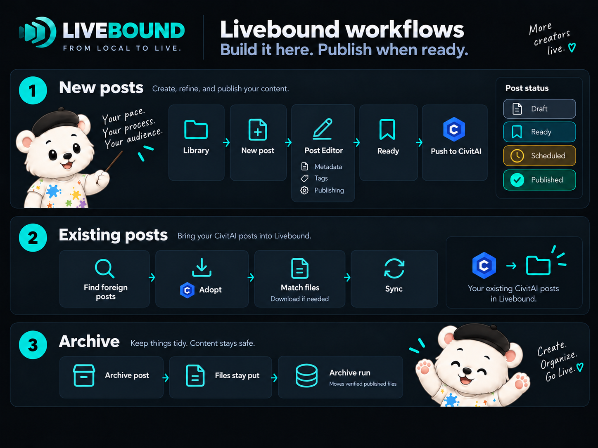

# Livebound


*From local to live.*

Livebound is a local-first publishing workspace for CivitAI creators. It reads the image folders you already use, brings generation metadata and resources into one browser-based workspace, and helps you turn selected images into planned CivitAI posts.

Livebound runs on your own machine. Your original image files are not rewritten when you edit metadata; changes are stored locally and applied to temporary upload copies when needed.

## What Livebound does

- Builds a local library from one or more image folders without reorganising them.
- Reads generation metadata from common AI image tools and keeps unsupported files usable in the library.
- Finds exact and likely duplicate images and offers a recoverable trash workflow.
- Helps review and edit prompts, generation parameters, models, LoRAs and other resources before publishing.
- Creates CivitAI drafts, schedules posts, publishes on your instruction, and reconciles local state with CivitAI afterwards.
- Adopts posts that already exist on your CivitAI account and can match or fetch their images locally.
- Moves files from posts you archived in Livebound into a structured image archive when you explicitly start the archive run and publication identity is verified.
- Optionally uses a local model or an Ollama server to suggest post text, tags, and prompt edits.
- Keeps its optional usage ping minimal and opt-in, with the receiver source published alongside the application. With the ping off, nothing is sent. A UUID does not exist until the first opt-in; turning the ping off later stops future pings while retaining that UUID locally.

## Why creators use Livebound

### I have so many images that I lose track of my own collection

Livebound turns the image folders you already have into a local gallery with search, filters and monitored folders. You can find the images that matter without opening folders one by one, then turn a selection into a post.

### I sometimes do not remember whether I already posted an image

Livebound connects local images to their publishing history. You can see whether an image has already been used, which post used it and which CivitAI image or post it belongs to.

### I repeat the same steps when I prepare many posts

Livebound keeps image review, metadata preparation, titles, descriptions, tags, resources and timing in one local workflow. You can prepare multiple posts through **Ready** and then push and schedule the finished work together.

### I want to plan several days or weeks ahead

Livebound supports fixed publication times and relative offsets, so finished images can be prepared as a series instead of turning into the same daily publishing routine.

### With older images I often no longer know which exact model or LoRA version I used

Livebound can identify local model and LoRA files by hash and bind them to concrete CivitAI model versions. Ambiguous matches stay visible instead of being guessed, which makes later resource attribution more reliable.

### If an upload is interrupted, I do not always know what already happened on CivitAI

Livebound checks a post with **preflight** before remote changes, records push progress so interrupted work can **resume**, and can **reconcile** the local post with CivitAI afterwards. If creation may have happened but the response was lost, it checks the remote state before another post is created instead of blindly trying again.

The complete creator problem-to-solution catalog is in [Why Livebound](public-doc/content/why-livebound.md).

## Workflow at a glance



## Install and start

A released build already contains the browser frontend. **Node.js is not required to run a release.**

### Recommended: Git checkout

Git is the recommended route because one command updates the same folder while keeping its installation-local configuration and virtual environment. Install Git once, and updates are a command from then on.

Linux/WSL:

```bash
git clone https://github.com/MoonBlack87/livebound.git
cd livebound
./webui.sh
```

Windows:

```bat
git clone https://github.com/MoonBlack87/livebound.git
cd livebound
webui.bat
```

To update a Git checkout later, close Livebound and run:

Linux/WSL:

```bash
./webui.sh --update
```

Windows:

```bat
webui.bat --update
```

`--update` runs `git pull --ff-only`, refreshes the application environment and built frontend when needed, then starts Livebound again. Because the checkout stays in the same application folder, its installation-local `.livebound/config.json` continues to point at the same data directory.

### ZIP installation

1. Open the [Livebound Releases page](https://github.com/MoonBlack87/livebound/releases).
2. Open the release you want and download its **Source code (zip)** archive.
3. Extract the ZIP to a normal writable folder. Do not run Livebound from inside the ZIP viewer.
4. Start Livebound:
   - **Windows:** double-click `webui.bat`, or run `webui.bat` from a terminal.
   - **Linux/WSL:** open a terminal in the extracted folder and run `./webui.sh`.
5. Complete first start in the browser. Choose the data directory this installation should use for its database, settings and other application state.

The starter creates the Python environment it needs and opens Livebound in your browser. Each extracted folder is its own Livebound installation. It remembers its chosen data directory in `<application-folder>/.livebound/config.json`. A fresh copy has no such pointer, so it shows first start even when another Livebound installation exists for the same user. If you accept the suggested default, its data lives under `<application-folder>/.livebound/data`.

### Updating a ZIP installation quickly

Close Livebound, extract the newer ZIP, and copy its contents over the existing application folder. Then start Livebound again. The existing `.livebound/config.json` and `.venv/` remain, so configuration survives and the environment does not need to be rebuilt. The cost is that files removed from the new release remain as leftovers in the folder.

### Updating a ZIP installation cleanly

Extract the newer ZIP into a fresh folder, then bring the existing `.livebound/` directory across before starting. This leaves no old application files behind. The `.venv/` is not carried across, so the next start rebuilds it and takes a few minutes.

One thing to watch: if you accepted the default at first start, your data is in `<old-application-folder>/.livebound/data` — database, thumbnails and backups, easily gigabytes. Move that directory, do not copy it, or you will have two complete data sets and may keep working on the wrong one. Confirm the new copy opens the expected library and settings before removing the old folder.

### Requirements

- Python 3.12 or newer.
- Windows, Linux, or WSL for the tested paths. macOS has not been tested and should be treated as use-at-your-own-risk.
- A CivitAI account for publishing, syncing, and resource lookups.
- Node.js 20 or newer only if you are changing the frontend or using development mode.

On first start, Livebound asks for its data directory, your CivitAI connection, an image folder, and an archive folder.

## Development and releases

Livebound uses separate development and public-release repositories. This repository contains the reviewed source for released versions and is the public place for issues and pull requests. Accepted contributions are carried forward into later Livebound releases.

## Contributing

Bug reports and pull requests are welcome. See `CONTRIBUTING.md` for the contribution flow, diagnostics, and the checks expected for a change.

## Supporting this

Livebound is free software and stays that way. Direct donations are not something I can accept, so here is what actually helps, cheapest first.

- **Costs nothing:** follow me on [CivitAI](https://civitai.red/user/Moonbear_AIArt) and [GitHub](https://github.com/MoonBlack87), like what you find useful, and tell me what is broken. A report I can reproduce is worth more than a compliment, and the fix lands for everybody.
- **Buzz** is always welcome if you have some spare, through the CivitAI shop, on an image, or for no reason at all.
- **Going further:** CivitAI has [gift memberships](https://civitai.red/pricing/gift?userId=6460214), which turn fairly directly into more time spent making things.
- **The one that helps most is still free:** download the open-source projects, star them, open issues. An active repository is what makes this work eligible for programmes that support open-source development.

- **Would rather talk than click?** Reach me on [CivitAI](https://civitai.red/user/Moonbear_AIArt), on [Reddit](https://www.reddit.com/user/MoonbearAIArt/), or on Discord as `rokudesigns_007`. Sponsorship, a collaboration or an idea for the tool is easier in a conversation than through a form.

## Acknowledgements

Livebound's metadata support was informed by real-world samples and format research from projects including [sd-metadata](https://github.com/enslo/sd-metadata) by Rikuto Nakao (MIT) and [fooocus-metadata](https://github.com/fkleon/fooocus-metadata) by Frederik Leonhardt (AGPL-3.0). Livebound uses its own implementation; these projects are credited for the useful public examples and format knowledge they make available.

## Your files

Livebound moves and deletes files on your disk when you ask it to — the duplicate
trash, restore, the archive run and permanent deletion all touch real files. The
irreversible ones ask you to type a confirmation first.

It has been tested to the best of our knowledge and belief and no defect in those
paths is known. That is a statement about care taken, not a guarantee.

> ⚠️ **By using Livebound you accept sole responsibility for your files, and no
> liability for data loss is accepted.**
>
> Keep your own backups of your image folders and archive. Livebound's database
> backup covers Livebound's own state — it does not contain your images.

## Licence

Copyright (C) 2026 [Moonbear_AIArt](https://civitai.red/user/Moonbear_AIArt) ([MoonBlack87](https://github.com/MoonBlack87))

Livebound is free software under the **GNU Affero General Public License, version 3 or later**. See `LICENSE` for the complete licence text.

Livebound is an independent community project and is not affiliated with or endorsed by CivitAI.
